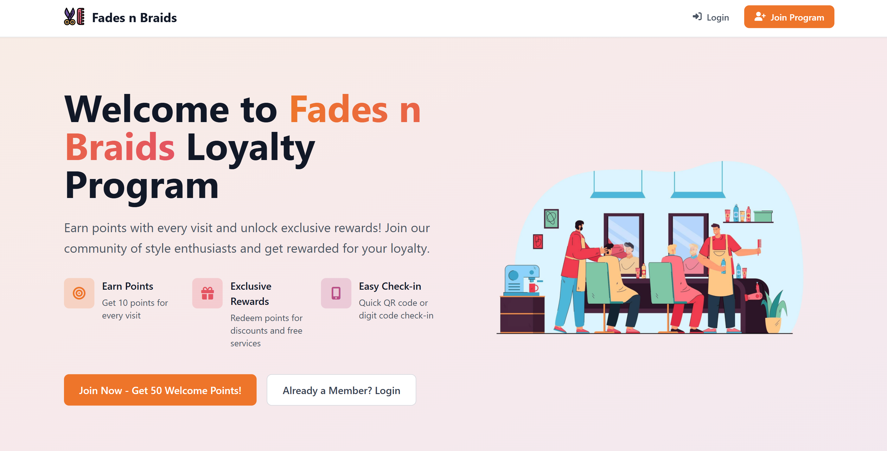
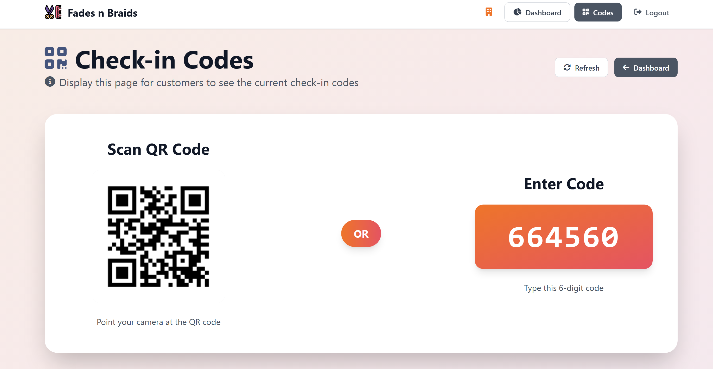

# Fades n Braids Loyalty System
### Live Site -> [fades-n-braids.onrender.com](https://fades-n-braids.onrender.com/)

<div align="center">
  

  <p><strong>A comprehensive loyalty program system for Fades n Braids salon that allows customers to earn points with every visit and redeem rewards.</strong></p>

  
</div>

## Screenshots

### Landing Page


### Customer Dashboard


### Business Dashboard


### Check-in Codes Display


## 📋 Table of Contents

- [📱 Screenshots](#-screenshots)
- [✨ Features](#-features)
- [🚀 Quick Start](#-quick-start)
- [🛠️ Technology Stack](#️-technology-stack)
- [📁 Project Structure](#-project-structure)
- [🔗 API Routes](#-api-routes)
- [🎨 Design System](#-design-system)
- [⚙️ Environment Variables](#️-environment-variables)
- [🧪 Testing Scenarios](#-testing-scenarios)
- [📝 Development Notes](#-development-notes)

## ✨ Features

### 👤 Customer Features
- 📱 **Registration & Login**: Phone number-based authentication
- 🎯 **Points System**: Earn 10 points per visit + 50 welcome bonus
- 📲 **QR/Digit Code Check-in**: Quick check-in system with real-time codes
- 🎁 **Rewards Catalog**: Browse and redeem available rewards
- 📊 **Visit History**: Track all visits and points earned
- 📱 **Mobile-Responsive**: Optimized for mobile devices

### 🏢 Business Features
- 📈 **Dashboard**: Overview of customers, visits, and statistics
- 👥 **Customer Management**: View and manage customer accounts
- 🎁 **Rewards Management**: Create, edit, and manage reward offerings
- 🔢 **Check-in Codes**: Display QR codes and digit codes for customer check-ins
- ⭐ **Points Management**: Award bonus points to customers
- ⚙️ **Settings**: Configure points per visit, welcome bonus, etc.

## 🚀 Quick Start

### 📋 Prerequisites
- 🟢 **Node.js** (v14 or higher)
- 🍃 **MongoDB** (local or cloud instance)

### ⚡ Installation Steps

1. **📦 Install dependencies**
   ```bash
   npm install
   ```

2. **🔧 Create environment file**
   ```bash
   cp .env.example .env
   ```

   📝 Edit `.env` with your MongoDB connection string and other settings.

3. **🗄️ Initialize the database**
   ```bash
   npm run init
   ```

4. **🚀 Start the development server**
   ```bash
   npm run dev
   ```

5. **🌐 Access the application**
   - 🏠 **Main site**: http://localhost:3000
   - 🏢 **Business login**: http://localhost:3000/business/login
     - 📧 Email: `admin@fadesbraids.com`
     - 🔑 Password: `admin123`

## 🛠️ Technology Stack

### 🖥️ Backend
- **Node.js** with Express.js framework
- **MongoDB** with Mongoose ODM
- **JWT** for authentication and session management
- **bcrypt** for password hashing
- **Handlebars (hbs)** for server-side templating

### 🎨 Frontend
- **Vanilla JavaScript** for client-side functionality
- **CSS3** with custom properties and responsive design
- **Font Awesome** for icons
- **Mobile-first** responsive design approach

### 🔧 Development Tools
- **nodemon** for development server
- **dotenv** for environment variable management
- **express-rate-limit** for API rate limiting

## 📁 Project Structure

```
fades-n-braids-loyalty/
├── 📁 config/
│   ├── database.js          # MongoDB connection
│   └── env.js              # Environment configuration
├── 📁 controllers/
│   ├── businessController.js
│   ├── customerController.js
│   ├── checkinController.js
│   └── rewardController.js
├── 📁 middleware/
│   ├── auth.js             # Authentication middleware
│   └── validation.js       # Input validation
├── 📁 models/
│   ├── Business.js
│   ├── Customer.js
│   ├── CheckInCode.js
│   └── Reward.js
├── 📁 public/
│   ├── css/                # Stylesheets
│   ├── clientSideJs/       # Client-side JavaScript
│   └── images/             # Static images & screenshots
├── 📁 routes/
│   ├── api/                # API routes
│   ├── business.js         # Business dashboard routes
│   └── customer.js         # Customer routes
├── 📁 views/
│   ├── layout/             # Handlebars layouts
│   ├── business/           # Business templates
│   └── 👤 customer/           # Customer templates
├── server.js               # Main server file
├── package.json
└── .env.example           # Environment variables template
```

## 🔗 API Routes

### 🔐 Authentication
- `POST /api/customers/register` - Customer registration
- `POST /api/customers/login` - Customer login
- `POST /api/customers/logout` - Customer logout
- `POST /api/business/login` - Business login
- `POST /api/business/logout` - Business logout

### 👤 Customer Features
- `GET /api/customers/profile` - Get customer profile
- `POST /api/customers/checkin` - Check-in with code
- `GET /api/customers/rewards` - Get available rewards
- `GET /api/customers/rewards/claimed` - Get claimed rewards
- `POST /api/customers/redeem` - Redeem a reward

### 🏢 Business Features
- `GET /api/business/customers` - Get all customers
- `GET /api/business/stats` - Get business statistics
- `POST /api/business/rewards` - Create new reward
- `PUT /api/business/rewards/:id` - Update reward
- `DELETE /api/business/rewards/:id` - Delete reward
- `POST /api/business/award-points` - Award points to customer

### 📲 Check-in System
- `GET /api/checkin/current-code` - Get current check-in code
- `POST /api/checkin/validate` - Validate check-in code

## 🎨 Design System

### 🌈 Color Palette

<div style="display: flex; flex-wrap: wrap; gap: 10px; margin: 20px 0;">
  <div style="background: #ee752a; color: white; padding: 10px; border-radius: 5px; min-width: 120px;">
    <strong>#ee752a</strong><br>Primary Orange
  </div>
  <div style="background: #e45462; color: white; padding: 10px; border-radius: 5px; min-width: 120px;">
    <strong>#e45462</strong><br>Primary Pink
  </div>
  <div style="background: #b95087; color: white; padding: 10px; border-radius: 5px; min-width: 120px;">
    <strong>#b95087</strong><br>Primary Purple
  </div>
  <div style="background: #7b5690; color: white; padding: 10px; border-radius: 5px; min-width: 120px;">
    <strong>#7b5690</strong><br>Primary Violet
  </div>
  <div style="background: #44547c; color: white; padding: 10px; border-radius: 5px; min-width: 120px;">
    <strong>#44547c</strong><br>Primary Blue
  </div>
  <div style="background: #2f4858; color: white; padding: 10px; border-radius: 5px; min-width: 120px;">
    <strong>#2f4858</strong><br>Primary Dark
  </div>
</div>

### 🎯 Design Principles
- **Mobile-First**: Responsive design optimized for mobile devices
- **Gradient Backgrounds**: Beautiful gradient overlays for visual appeal
- **Smooth Animations**: Subtle transitions and hover effects
- **Typography**: Clean, readable fonts with proper hierarchy
- **Accessibility**: High contrast ratios and semantic HTML

## ⚙️ Environment Variables

Create a `.env` file based on `.env.example`:

```env
# Database Configuration
MONGODB_URI=mongodb://localhost:27017/fades-n-braids

# JWT Security
JWT_SECRET=your-super-secret-jwt-key

# Server Configuration
PORT=3000
NODE_ENV=development

# Business Account
BUSINESS_EMAIL=admin@fadesbraids.com
BUSINESS_PASSWORD=admin123

# Points System
POINTS_PER_VISIT=10
WELCOME_BONUS_POINTS=50
```

> **⚠️ Security Note**: Never commit your actual `.env` file to version control. Always use strong, unique values for production environments.

## Project Development Prompts

This section documents the structured development approach used to build the Fades n Braids Loyalty System. The project was developed in phases, with each prompt focusing on specific functionality and deliverables.

### Phase 1: Project Setup & Configuration

#### Prompt 1: Initialize Project Structure
**Goal**: Set up the foundational structure.

**Task**: Initialize a Node.js project for Fades n Braids loyalty system with:
1. Express.js backend.
2. Handlebars (hbs) for server-side templating.
3. MongoDB as the database.
4. JWT for session management.
5. Environment variables for sensitive data (MongoDB URI, JWT secret).

**Deliverables**:
- A `README.md` with setup instructions (e.g., `npm install`, env variables).
- Project structure:
  ```
  /config (DB connection, env setup)
  /controllers
  /models
  /public (CSS, JS, images)
  /routes
  /views (Handlebars templates)
  ```
- Base files: `server.js`, `.env.example`.
- No UI yet; focus on backend scaffolding.

### Phase 2: Database & Auth

#### Prompt 2: Configure MongoDB Schemas
**Goal**: Define data models.

**Task**: Define MongoDB schemas for:
1. **Customer**:
   - `phone` (unique, required), `password` (hashed), `name`, `loyaltyPoints`, `visitHistory` (array of { timestamp, serviceType }).
2. **Admin**:
   - `username` (unique), `password` (hashed), `role`.
3. **Reward**:
   - `name`, `pointsRequired`, `description`, `isActive`.
4. **CheckInCode**:
   - `code` (QR/numeric), `expiresAt` (5-minute TTL).

**Deliverables**:
- Mongoose models in `/models`.
- Indexes for frequently queried fields (`phone`, `username`).
- Validation (e.g., phone format, password strength).

#### Prompt 3: Implement JWT Auth
**Goal**: Secure customer/admin login.

**Task**: Implement JWT-based authentication:
1. Customers log in with **phone + password**.
2. Admins log in with **username + password**.
3. Use `bcrypt` for password hashing.
4. Generate JWTs with `role` claims (customer/admin).
5. Protect routes with middleware:
   - `/dashboard` → Admin-only.
   - `/rewards` → Customer-only.

**Deliverables**:
- Auth middleware in `/middlewares/auth.js`.
- Login/register routes in `/routes/auth.js`.
- HTTP-only cookies for JWT storage.

### Phase 3: Core Features

#### Prompt 4: Check-In System
**Goal**: Enable QR/numeric code check-ins.

**Task**: Build a check-in system where:
1. A **public screen** in the shop displays a QR code + 4-digit number.
   - Codes refresh every 5 minutes (use `setInterval`).
   - Codes stored in MongoDB with TTL.
2. Customers check in by:
   - Scanning QR (pre-fills code on their web app).
   - Manually entering the 4-digit code.
3. On valid check-in:
   - Timestamp the visit.
   - Increment loyalty points.

**Deliverables**:
- Route `/check-in` (POST) to validate codes.
- Real-time code generation in `/controllers/checkin.js`.
- Handlebars template for the public screen (`/views/checkin-code.hbs`).

#### Prompt 5: Rewards Management
**Goal**: Let admins define rewards; customers claim them.

**Task**: Implement rewards logic:
1. **Admin Dashboard**:
   - CRUD interface to create/modify rewards.
   - Toggle rewards active/inactive.
2. **Customer Dashboard**:
   - List redeemable rewards (filter by `pointsRequired <= customerPoints`).
   - Claim rewards (deduct points, log transaction).

**Deliverables**:
- Reward routes (`/rewards/create`, `/rewards/claim`).
- Handlebars templates for rewards tables (admin/customer).

### Phase 4: UI & Responsiveness

#### Prompt 6: Landing Page
**Goal**: Create a mobile-first landing page.

**Task**: Build a responsive landing page with:
1. Hero section:
   - Illustration image **above** text on mobile.
   - Dynamic points display if customer is logged in.
2. Color scheme:
   - Primary: `#ee752a`, `#44547c`, `#2f4858`.
   - Accents: `#e45462`, `#b95087`.
3. Responsive CSS:
   - Separate files (`hero.css`, `auth.css`) to avoid bloat.
   - Subtle animations (e.g., hover effects, fade-ins).

**Deliverables**:
- Handlebars template (`/views/home.hbs`).
- Mobile-optimized CSS with media queries.

#### Prompt 7: Fix Dashboard UI Issues
**Goal**: Resolve known UI bugs.

**Task**: Address these issues:
1. **Customer Dashboard**:
   - Fix points calculation (total = sum of visit points).
   - Style `Recent Activity` with `max-height` and scroll.
2. **Admin Dashboard**:
   - Fix tab switching (Customers/Rewards/Analytics).
   - Contrast fixes for headers/cards.
   - Ensure stats update in real-time.
3. **Mobile Headers**:
   - Debug menu toggles (ensure no JS conflicts).

**Deliverables**:
- Refactored CSS/JS (no redundant styles or functions).
- Tested responsive layouts.

### Phase 5: Testing & Documentation

#### Prompt 8: Test Routes & Write README
**Goal**: Ensure reliability and clarity.

**Task**:
1. Document all API routes for testing (e.g., Thunder Client):
   - Sample requests/responses for `/login`, `/check-in`, `/rewards/claim`.
2. Write a `README.md` with:
   - Setup instructions.
   - Route examples.
   - Testing scenarios (e.g., 'How to simulate a check-in').

**Deliverables**:
- Updated `README.md`.
- Verified working routes (no 404/500 errors).

## 🧪 Testing Scenarios

### 👤 Customer Registration & Login
1. **Register New Customer**
   ```bash
   POST /api/customers/register
   Content-Type: application/json

   {
     "firstName": "John",
     "lastName": "Doe",
     "phone": "1234567890",
     "password": "password123"
   }
   ```

2. **Customer Login**
   ```bash
   POST /api/customers/login
   Content-Type: application/json

   {
     "phone": "1234567890",
     "password": "password123"
   }
   ```

### 📲 Check-in Process
1. **🔢 Get Current Check-in Code**
   ```bash
   GET /api/checkin/current-code
   ```

2. **✅ Customer Check-in**
   ```bash
   POST /api/customers/checkin
   Content-Type: application/json
   Authorization: Bearer <customer-token>

   {
     "code": "1234"
   }
   ```

### 🎁 Rewards System
1. **📋 Get Available Rewards**
   ```bash
   GET /api/customers/rewards
   Authorization: Bearer <customer-token>
   ```

2. **✨ Redeem Reward**
   ```bash
   POST /api/customers/redeem
   Content-Type: application/json
   Authorization: Bearer <customer-token>

   {
     "rewardId": "reward_id_here"
   }
   ```

### 🏢 Business Operations
1. **Business Login**
   ```bash
   POST /api/business/login
   Content-Type: application/json

   {
     "email": "admin@fadesbraids.com",
     "password": "admin123"
   }
   ```

2. **Create New Reward**
   ```bash
   POST /api/business/rewards
   Content-Type: application/json
   Authorization: Bearer <business-token>

   {
     "title": "Free Haircut",
     "description": "Get a complimentary haircut",
     "pointsRequired": 500,
     "category": "free_service",
     "value": "$25"
   }
   ```

## 📝 Development Notes

### 🎯 Key Design Decisions
1. **Phone-based Authentication**: Simplified customer registration using phone numbers instead of email
2. **JWT with HTTP-only Cookies**: Secure token storage to prevent XSS attacks
3. **Separate Customer/Business Interfaces**: Clear separation of concerns and user experiences
4. **Mobile-first Design**: Optimized for salon customers using mobile devices
5. **Real-time Check-in Codes**: 5-minute TTL codes for secure and timely check-ins

### 🔒 Security Considerations
- Password hashing with bcrypt
- JWT token expiration and refresh
- Rate limiting on authentication endpoints
- Input validation and sanitization
- CORS configuration for API security

### ⚡ Performance Optimizations
- Database indexing on frequently queried fields
- Efficient aggregation pipelines for statistics
- Client-side caching of static assets
- Optimized CSS and JavaScript delivery

### 🎨 UI/UX Features
- Responsive design with mobile-first approach
- Beautiful gradient backgrounds and smooth animations
- Intuitive navigation and user flows
- Real-time updates and live statistics
- Interactive rewards system with visual feedback

---

<div align="center">
  <p><strong>Built with ❤️ for Fades n Braids</strong></p>
  <p>© 2025 Fades n Braids Loyalty System</p>
</div>

